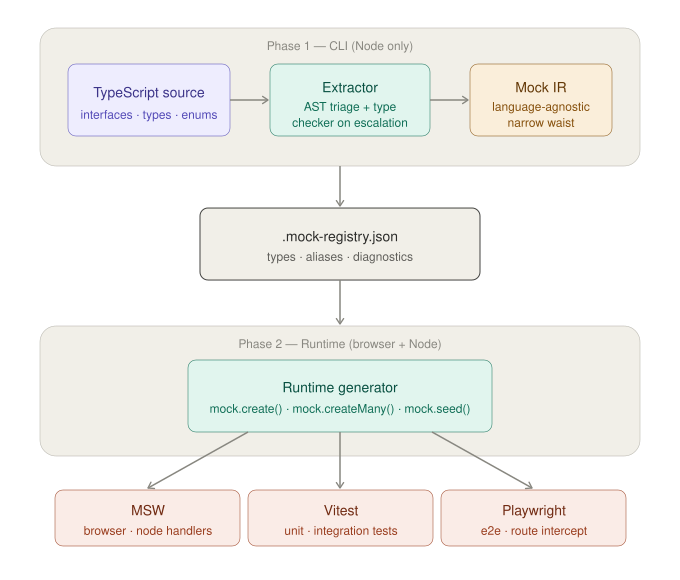

# doppelforge

> Forge convincing doubles of your data from TypeScript types.

doppelforge reads your TypeScript interfaces ahead of time, produces a lightweight `.mock-registry.json`, and uses that registry at runtime to generate realistic mock payloads for browser and Node testing.

## How it works

## Packages

| Package | Description |
|---|---|
| [`@doppelforge/ir`](./packages/ir/README.md) | IR type definitions — the contract between CLI and runtime |
| `@doppelforge/cli` | TypeScript extractor and registry generator *(coming soon)* |
| `@doppelforge/runtime` | Universal mock generator for browser and Node *(coming soon)* |

## Architecture

The central design decision is a two-phase split:

- **Phase 1 (CLI)** — runs at development time, Node only. Reads your TypeScript project via `ts-morph`, extracts type information into a language-agnostic intermediate representation, and writes a `.mock-registry.json` file.
- **Phase 2 (Runtime)** — runs at test time, browser and Node. Reads the registry and generates realistic mock data using Faker. Has no knowledge of TypeScript.

This split keeps the browser runtime lightweight — the TypeScript compiler never ships to the browser.

For detailed architectural decisions see [`docs/adr/`](./docs/adr/).

## Status

Early development — pre-alpha. The IR contract is locked and documented. Runtime and CLI are under active development.

## Licence

MIT © [Mayumi Nishimoto]